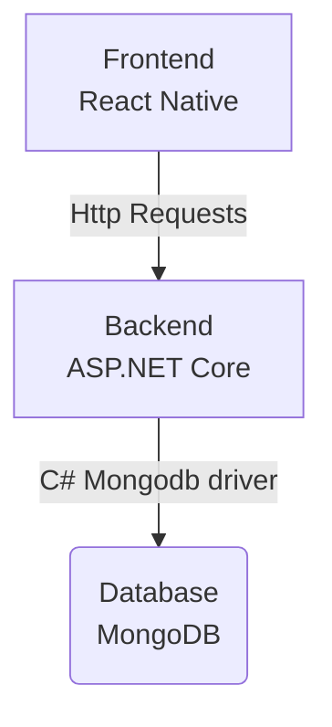

<p align="center">
</img>
</img>
</p>

<h1 align="center">TasteTailor</h1>h1>
Made for Hack8all hackathon 2024
The aim of the project is two help out freshers in making a choice on what to eat and also to help seniors by helping them understand their taste tolerances with respect to the rest of the student body so they can search for exactly what they want without needing to co-relate an arbitrary number to a taste.

<h1 align="center">Tech Stack</h1>





# Installation and Setup

- If you want to just use the app then head to the [releases](https://github.com/TanmayArya-1p/TasteTailor-RN/releases) section and download the latest APK file.
## Build Your Own APK
#### Pre-requisites:
      - NPM 
      - Node.js
      - Android SDK
      - Java JDK (ideally JDK 17.0)

###
- Install React Native using npm:
     ```npm install react-native```
- Clone this repository locally on to your machine
      ```git clone https://github.com/TanmayArya-1p/TasteTailor-RN.git```
- Install Required Packages:
      ```npm install```
- Connect your Android Device or Open up an Android Emulator
- Run the following command to start the React Metro Server:
        ```npm start --reset-cache```
- Run the App by running the following command:
        ```npm run android```

**The App backend is written in C# and you can check it out [here](https://github.com/toasty1307/SegFault.Backend)**
